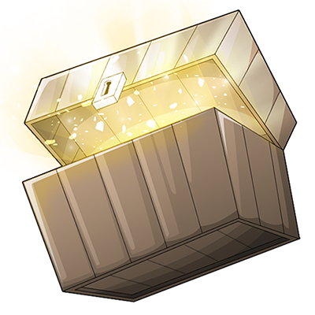

# CrateReloaded

The purpose of this repository, as of right now, is to keep track of issues as well as features.
Click the image below for our Discord channel for other support!

## Goals
* To create a sturdy, rewards system
* Increase community participation
* Inspire trade and other logistics

## How do I submit a request?

1. Head over to [#issues](https://github.com/Hazebyte/CrateReloaded/issues)
2. Make sure your feature has **not** been submitted yet
3. Either create a new issue or contribute to the thread already existing for the issue.

## More Information
* [Premium](https://www.spigotmc.org/resources/mystery-crate-cratereloaded-for-the-finest-servers.3663/)
* [Free](https://www.spigotmc.org/resources/mystery-crate-cratereloaded.861/)
* [Documentation](https://hazebyte.github.io/CrateReloaded/#/)

## Related Repositories
* [Documentation](https://github.com/Hazebyte/crate.hazebyte.com)
* [API](https://github.com/Hazebyte/CrateReloadedAPI)
* [NPC](https://github.com/Hazebyte/CrateReloadedNPC)
