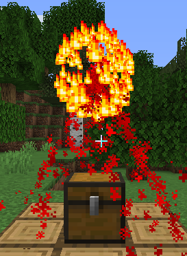

# DiscoBall Effect


## Settings

| Key    | Expects | Description                               |
| ------ | ------- | ----------------------------------------- |
| sphereRadius | integer | The range at which particles may generate |
| max | integer | max sizes of lines |
| sphereParticle | enum | | 
| lineParticle | enum | |
| sphereColor | hex | | 
| lineColor | hex | | 
| maxLines | integer | |

## Example

```YML
        1:
          class: DiscoBall
          category: PERSISTENT
          relativeOffset: "0,2,0"
```
