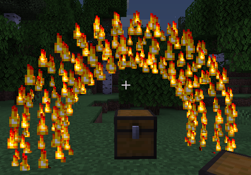

# Donut Effect



## Settings

| Key             | Expects | Description                               |
| --------------- | ------- | ----------------------------------------- |
| radiusDonut     | double  | The range at which particles may generate |
| particlesCircle | integer |                                           |
| circles         | integer |                                           |
| radiusTube      | double  |                                           |
| xRotation       | double  |                                           |
| yRotation       | double  |                                           |
| zRotation       | double  |                                           |

## Example

```YML
        1:
          class: Donut 
          category: PERSISTENT
```
