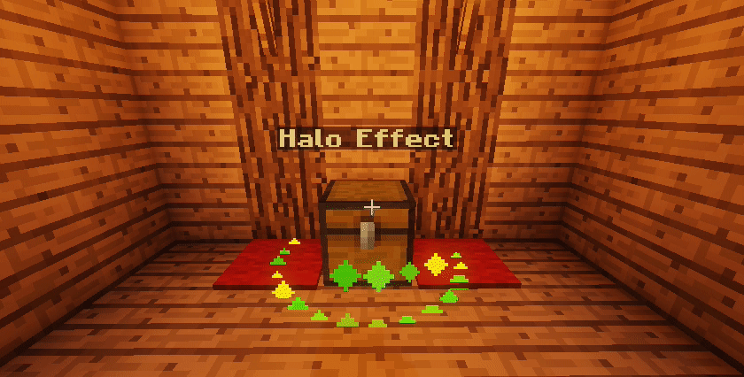

# Effects

## What are effects and how do they work?

CrateReloaded has support for a few effect types. This feature will allow you to change the animation of the particle effects to a preset layout.
These preset layouts are built using mathematical equations to determine the path of the particle.

## What particle effects can I use?

We have a designated page for this exact thing. [Check out our particle/sound effects page.](https://hazebyte.github.io/Documentation/#/particle-sound)

## What types of effects are there?

There are three types of effects.

<h3 align="center">Normal Effect</h3>

<h3 align="center">Halo Effect</h3>

<h3 align="center">Sphere Effect</h3>

## How can I change the effect?

These effects are fantastic and easy to use. We have designed the plugin like this to make it as simple as possible for you to use.

To add a preset effect to the particle simply add `:<effectType>`

An example of this would be `dormantEffects: 'happyVillager:halo'`. This would make a happyVillager particle effect roam around the crate in the form of a halo.
